# 🌌 Oxide-JS API Documentation Hub

Welcome to the official **Oxide-JS** (formerly **ML-V1**) API Reference and Navigation Hub. Oxide-JS is a high-performance, modular machine learning ecosystem for Node.js and TypeScript, accelerated by a customized **Rust Native Backend** (via napi-rs).

---

## 🧭 `@oxide-js/core` API Navigation Directory

Here is the central directory containing the complete, detailed API documentation pages for the **`@oxide-js/core`** module. Each reference document has been systematically expanded to include rigorous explanations, mathematical foundations, parameter details, and concrete, copy-pasteable TypeScript code examples for every constructor, helper function, and option.

| Module / Topic | Documentation Link | Description |
| :--- | :--- | :--- |
| **🧮 Matrix Structure** | **[matrix.md](file:///home/akhyar/Dokumen/Code/NODE_JS/Oxide-JS/docs/api/core/matrix.md)** | Flat `Float32Array` memory buffers, tensor shapes, properties, getters/setters, copying, and native in-place utilities. |
| **📐 Accelerated Math** | **[math.md](file:///home/akhyar/Dokumen/Code/NODE_JS/Oxide-JS/docs/api/core/math.md)** | Core dispatcher namespace `mj` covering matrix dot-products, element-wise math, axis reductions, and random weight initializations (Xavier/He). |
| **⚡ Activation Catalog** | **[activation.md](file:///home/akhyar/Dokumen/Code/NODE_JS/Oxide-JS/docs/api/core/activation.md)** | Non-linear activations, standard mappings (`relu`, `lRelu`, `sigmoid`, `tanh`, `softmax`, `linear`) and advanced kernels (`elu`, `selu`, `gelu`, `swish`, `mish`, etc.). |
| **📉 Cost Functions** | **[cost.md](file:///home/akhyar/Dokumen/Code/NODE_JS/Oxide-JS/docs/api/core/cost.md)** | Error assessment and analytical gradients including `MeanSquaredError`, `CategoricalCrossEntropy`, `BinaryCrossEntropy`, and `SoftmaxCrossEntropy`. |
| **📈 Optimizers** | **[optimizer.md](file:///home/akhyar/Dokumen/Code/NODE_JS/Oxide-JS/docs/api/core/optimizer.md)** | Parameter weights tuning and learning schedules including `SGD`, `Adam` (with moment tracking), `Momentum`, `NAG`, `AdaGrad`, and sparse embedding updates. |
| **🔠 BPE Tokenizer** | **[tokenizer.md](file:///home/akhyar/Dokumen/Code/NODE_JS/Oxide-JS/docs/api/core/tokenizer.md)** | Byte-Pair Encoding subword vocabulary builder, incremental updates, saving/loading, and 5 distinct pre-tokenizers (graphemes, scripts, words). |
| **🔄 Auto-Diff (Autograd)** | **[autodiff.md](file:///home/akhyar/Dokumen/Code/NODE_JS/Oxide-JS/docs/api/core/autodiff.md)** | Lightweight `Tape` recorder and the global autograd `engine` singleton managing dynamic gradients, backward passes, and LIFO snapshots. |
| **🛠️ Pipeline Utilities** | **[utils.md](file:///home/akhyar/Dokumen/Code/NODE_JS/Oxide-JS/docs/api/core/utils.md)** | Performance helpers such as dynamic padding trims (`trimPaddingBatch`), training set splitters (`splitTrainValidation`), metrics, and UI progress formatters. |
| **🏷️ Type Definitions** | **[types.md](file:///home/akhyar/Dokumen/Code/NODE_JS/Oxide-JS/docs/api/core/types.md)** | TypeScript structure schemas, layout configs (`FitConfig`, `FitResult`), tensor data types, and status enumerations. |

---

## 🧭 `@oxide-js/layers` API Navigation Directory

Here is the central directory containing the complete, detailed API documentation pages for the **`@oxide-js/layers`** module. Each reference document has been systematically expanded to include rigorous explanations, mathematical foundations, parameters, and concrete, copy-pasteable TypeScript code examples for every layer.

| Module / Topic | Documentation Link | Description |
| :--- | :--- | :--- |
| **🏗️ Base Specification** | **[base.md](file:///home/akhyar/Dokumen/Code/NODE_JS/Oxide-JS/docs/api/layers/base.md)** | Core abstract class `BaseLayer` defining the execution contract, lifecycle hooks, properties, and serialization utilities. |
| **🎛️ Core Layers** | **[core.md](file:///home/akhyar/Dokumen/Code/NODE_JS/Oxide-JS/docs/api/layers/core.md)** | Fundamental dense connections, activations, dropout regularizers, flattening operations, and shape restructuring. |
| **⚖️ Normalization** | **[normalization.md](file:///home/akhyar/Dokumen/Code/NODE_JS/Oxide-JS/docs/api/layers/normalization.md)** | Layer normalization and batch normalization metrics, scaling dynamics, stability tolerances, and moving statistics. |
| **🗺️ Sequence Embedding** | **[embedding.md](file:///home/akhyar/Dokumen/Code/NODE_JS/Oxide-JS/docs/api/layers/embedding.md)** | Lookup map tables translating integer tokens to continuous vector spaces with sparse backpropagation support. |
| **📐 Convolutional & Pooling** | **[convolution.md](file:///home/akhyar/Dokumen/Code/NODE_JS/Oxide-JS/docs/api/layers/convolution.md)** | Spatial feature modeling via 1D/2D convolutions and sliding-window downsamplers using native col/grid math mappings. |
| **🔁 Recurrent Layers** | **[recurrent.md](file:///home/akhyar/Dokumen/Code/NODE_JS/Oxide-JS/docs/api/layers/recurrent.md)** | Sequence learning architectures covering SimpleRNN, GRU, and LSTM gates transitions with Backpropagation Through Time (BPTT). |
| **🌌 Attention Mechanisms** | **[attention.md](file:///home/akhyar/Dokumen/Code/NODE_JS/Oxide-JS/docs/api/layers/attention.md)** | Scaled dot-product self-attention and causal MultiHeadAttention (MHA) with dynamic caching and cross-attention triggers. |
| **🔄 Residual Connections** | **[residual.md](file:///home/akhyar/Dokumen/Code/NODE_JS/Oxide-JS/docs/api/layers/residual.md)** | Native skip connection operators bypassing computational nodes to stabilize gradient flows in deep neural networks. |

---

## 🏗️ Monorepo Architecture Blueprint

The following diagram illustrates how the monorepo layers interact, highlighting the zero-copy, highly optimized bridge connecting TypeScript to the raw Rust kernels:

```mermaid
graph TD
    subgraph Client ["Client Space"]
        App["TypeScript App / Training Script"]
    end

    subgraph ModelsPkg ["@oxide-js/models"]
        BaseModel["[BaseModel](file:///home/akhyar/Dokumen/Code/NODE_JS/Oxide-JS/packages/models/src/BaseModel.ts)"]
        Sequential["[Sequential](file:///home/akhyar/Dokumen/Code/NODE_JS/Oxide-JS/packages/models/src/Sequential.ts)"]
        Callbacks["[Callbacks](file:///home/akhyar/Dokumen/Code/NODE_JS/Oxide-JS/packages/models/src/callbacks.ts) (EarlyStopping, etc.)"]
        Metrics["[Metrics](file:///home/akhyar/Dokumen/Code/NODE_JS/Oxide-JS/packages/models/src/metrics.ts) (MSE, accuracy, etc.)"]
    end

    subgraph LayersPkg ["@oxide-js/layers"]
        BaseLayer["[BaseLayer](file:///home/akhyar/Dokumen/Code/NODE_JS/Oxide-JS/packages/layers/src/base/BaseLayer.ts)"]
        Dense["[Dense](file:///home/akhyar/Dokumen/Code/NODE_JS/Oxide-JS/packages/layers/src/layers/Dense.ts)"]
        Embedding["[Embedding](file:///home/akhyar/Dokumen/Code/NODE_JS/Oxide-JS/packages/layers/src/layers/Embedding.ts)"]
        RNNs["[LSTM / GRU / SimpleRNN](file:///home/akhyar/Dokumen/Code/NODE_JS/Oxide-JS/packages/layers/src/layers/LSTM.ts)"]
        Attention["[MultiHeadAttention](file:///home/akhyar/Dokumen/Code/NODE_JS/Oxide-JS/packages/layers/src/layers/MultiHeadAttention.ts)"]
        CNNs["[Conv2D / MaxPooling2D](file:///home/akhyar/Dokumen/Code/NODE_JS/Oxide-JS/packages/layers/src/layers/Conv2D.ts)"]
    end

    subgraph CorePkg ["@oxide-js/core"]
        Matrix["[Matrix](file:///home/akhyar/Dokumen/Code/NODE_JS/Oxide-JS/packages/core/src/matrix/index.ts) (Float32Array-backed)"]
        MJ["[mj](file:///home/akhyar/Dokumen/Code/NODE_JS/Oxide-JS/packages/core/src/math/index.ts) (Math Dispatcher)"]
        Tape["[Tape](file:///home/akhyar/Dokumen/Code/NODE_JS/Oxide-JS/packages/core/src/autodiff/index.ts) (Automatic Differentiation)"]
        Tokenizer["[BPETokenizer](file:///home/akhyar/Dokumen/Code/NODE_JS/Oxide-JS/packages/core/src/tokenizer/index.ts)"]
        Opt["[Optimizers](file:///home/akhyar/Dokumen/Code/NODE_JS/Oxide-JS/packages/core/src/optimizer/index.ts) (Adam, SGD, etc.)"]
        Cost["[Cost Functions](file:///home/akhyar/Dokumen/Code/NODE_JS/Oxide-JS/packages/core/src/cost/index.ts)"]
    end

    subgraph NativeBridge ["oxide-native"]
        NapiBridge["NAPI-RS Native Binding Layer"]
        RayonKernel["Optimized Rust Kernels (Parallel Rayon & MatrixMultiply)"]
    end

    %% Flow of control and data
    App --> BaseModel
    BaseModel --> Sequential
    Sequential --> BaseLayer
    BaseLayer --> Matrix
    BaseLayer --> MJ
    MJ --> NapiBridge
    NapiBridge --> RayonKernel
    Tape --> Matrix
    
    style Client fill:#1a1b26,stroke:#7aa2f7,stroke-width:2px,color:#c0caf5
    style ModelsPkg fill:#1f2335,stroke:#bb9af7,stroke-width:2px,color:#c0caf5
    style LayersPkg fill:#1f2335,stroke:#2ac3de,stroke-width:2px,color:#c0caf5
    style CorePkg fill:#1f2335,stroke:#9ece6a,stroke-width:2px,color:#c0caf5
    style NativeBridge fill:#2e3c43,stroke:#f7768e,stroke-width:2px,color:#c0caf5
```



---

## 🔌 Workspace 2: `@oxide-js/layers`

The layers module encapsulates standard machine learning operations into isolated state managers extending `BaseLayer`. It provides modular parameters (`weights` and `biases`) and executes both forward-propagation calculations and backpropagation routines.

> **Source Entrypoint**: [packages/layers/src/index.ts](file:///home/akhyar/Dokumen/Code/NODE_JS/Oxide-JS/packages/layers/src/index.ts)

### The Layer Catalog

| Layer Name | Type | Key Configuration Parameters | Description |
| :--- | :--- | :--- | :--- |
| **[BaseLayer](file:///home/akhyar/Dokumen/Code/NODE_JS/Oxide-JS/packages/layers/src/base/BaseLayer.ts)** | Abstract Base | `name?: string`, `trainable?: boolean` | Structural interface for shapes, weights, state mode, and serialize hooks. |
| **[Dense](file:///home/akhyar/Dokumen/Code/NODE_JS/Oxide-JS/packages/layers/src/layers/Dense.ts)** | Core Layer | `units: number`, `outputUnits: number`, `activation: string` | Feed-forward fully connected layer with custom activations. |
| **[Embedding](file:///home/akhyar/Dokumen/Code/NODE_JS/Oxide-JS/packages/layers/src/layers/Embedding.ts)** | Sequence | `vocabSize: number`, `units: number`, `trainable?: boolean` | Maps token indices to dense continuous matrices. |
| **[LayerNormalization](file:///home/akhyar/Dokumen/Code/NODE_JS/Oxide-JS/packages/layers/src/layers/LayerNormalization.ts)** | Normalization | `epsilon?: number` | Performs feature-wise/token-wise normalization. |
| **[Dropout](file:///home/akhyar/Dokumen/Code/NODE_JS/Oxide-JS/packages/layers/src/layers/Dropout.ts)** | Regularization | `rate: number` | Randomly zeroes activations during training mode. |
| **[Conv2D](file:///home/akhyar/Dokumen/Code/NODE_JS/Oxide-JS/packages/layers/src/layers/Conv2D.ts)** | Convolutional | `filters: number`, `kernelSize: number`, `strides?: number` | 2D Spatial convolution for image modeling. |
| **[LSTM](file:///home/akhyar/Dokumen/Code/NODE_JS/Oxide-JS/packages/layers/src/layers/LSTM.ts)** | Recurrent | `units: number`, `returnSequences?: boolean` | Long Short-Term Memory sequence layer with stable gate biases. |
| **[GRU](file:///home/akhyar/Dokumen/Code/NODE_JS/Oxide-JS/packages/layers/src/layers/GRU.ts)** | Recurrent | `units: number`, `returnSequences?: boolean` | Gated Recurrent Unit sequence layer. |
| **[SimpleRNN](file:///home/akhyar/Dokumen/Code/NODE_JS/Oxide-JS/packages/layers/src/layers/SimpleRNN.ts)** | Recurrent | `units: number`, `returnSequences?: boolean` | Standard recurrent neural network block. |
| **[MultiHeadAttention](file:///home/akhyar/Dokumen/Code/NODE_JS/Oxide-JS/packages/layers/src/layers/MultiHeadAttention.ts)** | Attention | `heads: number`, `units: number`, `dropout?: number` | Multi-head self-attention layer with causal masking. |
| **[Residual](file:///home/akhyar/Dokumen/Code/NODE_JS/Oxide-JS/packages/layers/src/layers/Residual.ts)** | Advanced | `layer: BaseLayer` | Implements skip connections (residual addition) natively. |

---

## 📈 Workspace 3: `@oxide-js/models`

The models module structures custom multi-layer networks, configures the execution environment, runs high-level batched fitting operations, manages evaluation statistics, and schedules learning behaviors using callbacks.

> **Source Entrypoint**: [packages/models/src/index.ts](file:///home/akhyar/Dokumen/Code/NODE_JS/Oxide-JS/packages/models/src/index.ts)

---

## 🧭 `@oxide-js/models` API Navigation Directory

Here is the central directory containing the complete, detailed API documentation pages for the **`@oxide-js/models`** module. Each reference document has been systematically expanded to include rigorous explanations, interface properties, callbacks triggers, and concrete, copy-pasteable TypeScript code examples for every model container or helper.

| Module / Topic | Documentation Link | Description |
| :--- | :--- | :--- |
| **🏗️ BaseModel Specification** | **[base.md](file:///home/akhyar/Dokumen/Code/NODE_JS/Oxide-JS/docs/api/models/base.md)** | Core abstract class `BaseModel` detailing compilation, fitting pipelines, parameter counters, and Keras weight serialization. |
| **🥞 Sequential Stack** | **[sequential.md](file:///home/akhyar/Dokumen/Code/NODE_JS/Oxide-JS/docs/api/models/sequential.md)** | Stacked layers feed-forward container, dynamic building trigger, unique layer renaming, and E2E classifier setup. |
| **🎛️ Callback Observers** | **[callbacks.md](file:///home/akhyar/Dokumen/Code/NODE_JS/Oxide-JS/docs/api/models/callbacks.md)** | Observers hooks (epoch, batch bounds), and detailed guidelines on ProgressLogger, EarlyStopping, and custom logger pipelines. |
| **📊 Metrics & Data Helpers** | **[metrics.md](file:///home/akhyar/Dokumen/Code/NODE_JS/Oxide-JS/docs/api/models/metrics.md)** | Evaluation criteria math equations (accuracy, MAE, MSE), train-val slicing helpers, and mini-batch partition triggers. |

---

### 1. `BaseModel` & `Sequential`
- **[BaseModel](file:///home/akhyar/Dokumen/Code/NODE_JS/Oxide-JS/packages/models/src/BaseModel.ts)**: The primary abstract base class. It maintains compiling, training logs, weight serialization/deserialization, and high-level training pipelines.
- **[Sequential](file:///home/akhyar/Dokumen/Code/NODE_JS/Oxide-JS/packages/models/src/Sequential.ts)**: A streamlined subclass container designed for stacked networks, processing feed-forward layers sequentially:
  ```ts
  import { Sequential } from "@oxide-js/models";
  import { Dense } from "@oxide-js/layers";

  const model = new Sequential();
  model.add(new Dense({ units: 10, outputUnits: 32, activation: "relu" }));
  model.add(new Dense({ units: 32, outputUnits: 2, activation: "softmax" }));

  model.compile({
    optimizer: "adam",
    loss: "softmaxCrossEntropy",
    alpha: 0.001,
    metrics: ["accuracy"]
  });
  ```

### 2. High-Level Training Loop (`fit`)
`model.fit(x, y, config)` automatically drives training cycles:
```ts
model.fit(trainX, trainY, {
  epochs: 50,
  batchSize: 16,
  shuffle: true,
  validationSplit: 0.2, // Splitting validation data automatically
  callbacks: [
    new EarlyStopping({ patience: 5, monitor: "val_loss" }),
    new ProgressLogger()
  ]
});
```

### 3. Callbacks System
- **Key File**: [packages/models/src/callbacks.ts](file:///home/akhyar/Dokumen/Code/NODE_JS/Oxide-JS/packages/models/src/callbacks.ts)
- **`HistoryCallback`**: Tracks learning progress and computes training epochs statistics.
- **`EarlyStopping`**: Monitors target variables (e.g. `val_loss`) and safely halts training early once learning reaches a plateau.
- **`ProgressLogger`**: Standard console formatting displaying real-time loss tracking.

### 4. Metrics Evaluator
- **Key File**: [packages/models/src/metrics.ts](file:///home/akhyar/Dokumen/Code/NODE_JS/Oxide-JS/packages/models/src/metrics.ts)
- Standard evaluations: `accuracy`, `categoricalAccuracy`, `binaryAccuracy`, `mae`, `mse`.

---

## 💾 Keras Interoperability & Serialization

Every model built on `@oxide-js/models` is fully compatible with Keras and TensorFlow.js specifications. Model topology is stored inside a readable JSON manifest, whereas heavy matrices and physical parameters are written using efficient binary arrays.

### 1. Save Schema Configuration
Call `model.serialize()` to convert the layout into a clean structured JSON schema matching standard Keras topologies:
```json
{
  "class_name": "Sequential",
  "name": "SequentialModel",
  "trainable": true,
  "config": {
    "layers": [
      {
        "class_name": "Dense",
        "config": {
          "name": "Dense_1",
          "units": 10,
          "outputUnits": 32,
          "activation": "relu"
        }
      }
    ]
  },
  "weights": [
    {
      "name": "Dense_1/weights",
      "shape": [10, 32],
      "physicalShape": [10, 32],
      "dtype": "float32"
    }
  ]
}
```

### 2. Loading Weights
Use `model.setWeights(weightsData)` to dynamically load neural network weights at runtime:
```ts
const weightsManifest = [
  {
    name: "Dense_1/weights",
    shape: [10, 32],
    data: new Float32Array([...]) // Raw buffer loaded from disk
  }
];

model.setWeights(weightsManifest);
```

---

## ⚡ Complete E2E Interoperability Example

This script illustrates a complete end-to-end classification task: preparing raw matrices using **Core**, establishing layers through **Layers**, compiling and training using **Models** under real-time callbacks, and outputting evaluations:

```ts
import { mj, Matrix } from "@oxide-js/core";
import { Dense, Dropout } from "@oxide-js/layers";
import { Sequential, EarlyStopping, ProgressLogger } from "@oxide-js/models";

// 1. Prepare Synthetic Data (Binary Classification)
const inputs = Matrix.fromFlat(
  new Float32Array([
    0.1, 0.2,
    0.8, 0.9,
    0.2, 0.1,
    0.9, 0.8
  ]),
  [4, 2] // 4 samples, 2 features
);

const targets = Matrix.fromFlat(
  new Float32Array([
    0.0, 1.0,
    1.0, 0.0,
    0.0, 1.0,
    1.0, 0.0
  ]),
  [4, 2] // 4 samples, 2 classes (one-hot)
);

// 2. Compose the Neural Network Architecture
const model = new Sequential();
model.add(new Dense({ name: "dense_in", units: 2, outputUnits: 4, activation: "relu" }));
model.add(new Dropout({ name: "drop", rate: 0.1 }));
model.add(new Dense({ name: "dense_out", units: 4, outputUnits: 2, activation: "softmax" }));

// 3. Compile Model Settings
model.compile({
  optimizer: "adam",
  loss: "softmaxCrossEntropy",
  alpha: 0.01,
  metrics: ["accuracy"]
});

// 4. Fit the Model with Callbacks
console.log("Starting model training...");
model.fit(inputs, targets, {
  epochs: 100,
  batchSize: 2,
  shuffle: true,
  callbacks: [
    new ProgressLogger(),
    new EarlyStopping({ patience: 10, monitor: "loss" })
  ]
});

// 5. Predict and Evaluate Results
console.log("\nEvaluating model parameters...");
const prediction = model.predict(inputs);
console.log("Inputs Shape:", inputs._shape);
console.log("Prediction Output:");
prediction.print();

// 6. View Keras-Style Model Summary
console.log("\nModel Architecture Summary:");
model.summary();
```

---

> [!NOTE]
> Detailed configuration references, mathematics descriptions, and training benchmarks can be found under the [test suite](file:///home/akhyar/Dokumen/Code/NODE_JS/Oxide-JS/test/index.ts) or in the master [README](file:///home/akhyar/Dokumen/Code/NODE_JS/Oxide-JS/README.md) located at the root of the workspace.
