# Model Stability Experiment: RNN Family

This repository contains the setup, execution scripts, and results for a deep learning stability experiment designed to evaluate the consistency of the Recurrent Neural Network (RNN) family. All neural networks in this experiment are powered entirely by the **`@akhyar11/ml-v1`** native TypeScript library.

## 🎯 Experiment Objective
The primary goal of this experiment is to test the **stability, convergence capability, and reliability** of three distinct recurrent architectures:
1. Vanilla **RNN** (Recurrent Neural Network)
2. **LSTM** (Long Short-Term Memory)
3. **GRU** (Gated Recurrent Unit)

Since neural network training relies on stochastic processes (random weight initialization and mini-batching), a single successful training run is not enough to prove an architecture's superiority. Therefore, we executed **10 independent training repetitions** for each model type, wiping the weights completely clean between every run to measure their *Standard Deviation* and average performance reliably.

## ⚙️ Hardware & Environment Setup
- **Library**: `@akhyar11/ml-v1` (v2.3.0)
- **CPU**: 11th Gen Intel(R) Core(TM) i5-1135G7 @ 2.40GHz
- **RAM**: 15.41 GB
- **OS**: Linux CachyOS
- **Total Training Duration**: ~4 Hours 20 Minutes 34 Seconds

## 🧠 Neural Network Pipeline Topology
To ensure a fair comparison, all models share the exact same structural environment, with the only variable being the recurrent layer type.

```mermaid
graph LR
    A[BPE Tokenizer] -->|Input Sequence| B(Embedding Layer)
    B -->|Dense Vector| C{RNN / LSTM / GRU}
    C -->|Hidden State| D[Dense Output]
    
    classDef input fill:#1e293b,stroke:#475569;
    classDef embed fill:#312e81,stroke:#4f46e5;
    classDef recur fill:#064e3b,stroke:#10b981;
    classDef out fill:#881337,stroke:#f43f5e;
    
    class A input;
    class B embed;
    class C recur;
    class D out;
```

**Architectural Specifics**:
- **Vocabulary Size**: 15,182 tokens
- **Input Context**: Left-Padded arrays (Sequence Length = 128)
- **Embedding Dimension**: 128
- **Recurrent Hidden Units**: 32 (Return sequences=False, Stateful=False)
- **Output Classes**: 3 (Negative, Positive, Neutral)
- **Loss Function**: Softmax Cross Entropy
- **Optimizer**: Adam (Learning Rate = 0.001)

## 📊 Dataset Information
- **Training Samples**: 11,000
- **Validation Samples**: 1,260 (Evaluated every 5 epochs and at the end of training)

## 🏆 Final Result & Metric Breakdown

Below is the verified aggregation of the experimental runs. The metrics represent the **mean average score** collected across all 10 repetitions per architecture validation phase.

| Architecture | Parameters | Avg. Loss | Avg. Accuracy | Avg. F1 Score | Consistency Profile |
| :--- | :---: | :---: | :---: | :---: | :--- |
| **LSTM** | `1,964,003` | `0.0093` | **89.24%** | **85.16%** | Highly Stable |
| **GRU** | `1,958,851` | `0.1321` | 84.55% | 72.66% | Moderate Variation |
| **RNN** | `1,948,547` | `0.0141` | 83.62% | 76.72% | Moderate Variation |

### Deeper Assessment (Final Run Fallback)
When aggregating predictions against the exact 1,260 validation samples across the classes, the system achieved:
*   **Overall Dataset Accuracy**: 82.30%
*   **Macro F1-Score**: 74.38%
*   **Weighted F1-Score**: 81.83%

> Note: The dashboard server (`server.js`) was utilized to render real-time interactive HTML visual reports (`stability_report.html`) dynamically from the generated raw JSON telemetry logs.

## 📌 Conclusion
Based on the data collected by `@akhyar11/ml-v1`:
1. **LSTM Dominates**: The LSTM architecture proved to be the most superior variant for this specific Indonesian Text Classification task, achieving both the highest average accuracy (89.24%) and the highest F1 score (85.16%), alongside the lowest training loss variance.
2. **RNN vs GRU**: Vanilla RNN surprisingly managed to retain a highly competitive loss score (0.014) compared to GRU, though GRU performed marginally better on raw accuracy (84.55% vs RNN's 83.62%). 

The internal gating mechanism inside the LSTM clearly benefited the gradient flow across the 128-length sequence, managing the vanishing gradient problem efficiently and resulting in extremely stable training iterations.
